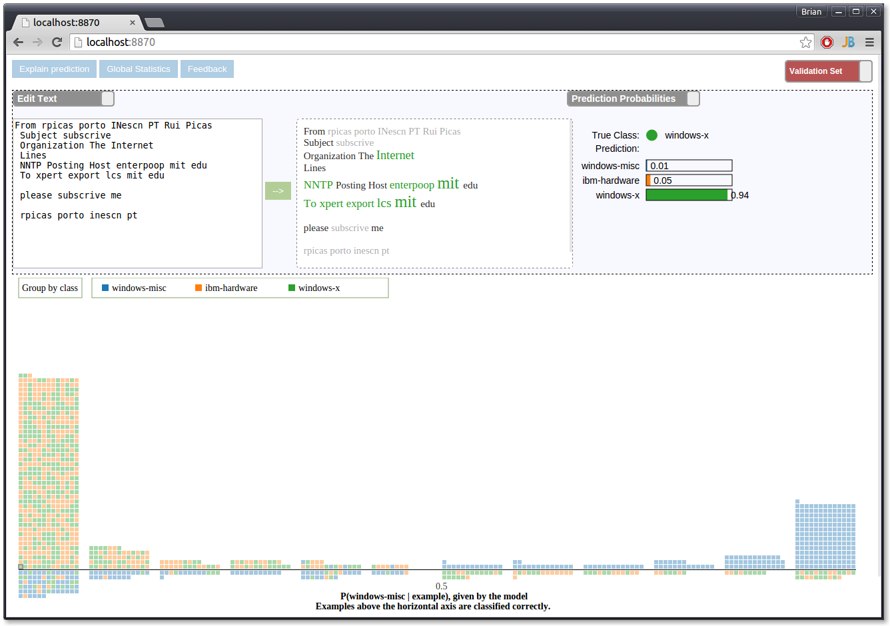

# A visualization tool for human-in-the-loop machine learning
===============

## Team Members

1. Marco Tulio Ribeiro marcotcr@cs.washington.edu
2. Brian Dolhansky bdol@cs.washington.edu

## Overview

Many people use machine learning algorithms blindly, just looking at summary statistics (i.e. accuracy). However, many times a model learns (what humans deem to be) irrelevant information, like email addresses or names in an email corpus. This type of behavior is called typically called overfitting, and is in general undesirable, as the model cannot be generalized to other datasets.

In reality, we would like the model to learn to place high weights on features relevant to the classification task. For instance, if we wish to predict whether an email was posted to a Windows or OS X list, we would like the model to place high weights on words like "Microsoft" and "Apple". If the model doesn't do this initially, then we must make changes either to the model or to the data so that the model can be applied to documents outside of the training corpus. 

We have produced an interactive visualization that lets users better understand what their algorithms are actually doing. We have included several datasets as an example, although this tool can be used with other text corpora. For the model, we used a standard L2 regularized logistic regression, a baseline for many papers, such as [this recent one](http://www.cs.cmu.edu/~dyogatam/papers/yogatama+smith.icml2014.pdf). Our visualization itself is a combination of the raw dataset and the machine learning model learned from it.

Our visualization tool allows a user to:
* Quickly see what words the model thinks are most important for each class.
* Interactively edit a document, and see how the prediction for that particular document changes.
* Edit the entire dataset using search and replace to see if the model learns something different
* Hover over particular words (by hovering), to better understand why the model is learning what it is learning by  way of summary statistics in the training data. We show the frequency of the word, and the class distribution in the training data.
* View the performance of the model on the entire dataset with the "databin."
* ...and much more!

When running the visualization for the first time, a detailed tutorial is given to introduce you to all the things our tool can do.

## Running Instructions

Generate a JSON-ized version of the dataset with `python server.py -d 3ng -j static/3ng.json`, and run the server with `python server.py -d 3ng -l static/3ng.json`. Access the tool at http://localhost:8870/.

## Development Process and breakdown

A rough breakdown of our development process and workload is:
* Marco: Generalizing the machine learning portion of the tool so that it runs on top of scikit-learn (a general-purpose Python ML library). This way it is simpler to plug and play different ML models. Added additional statistical tools such as the confusion matrix and "feature brushing." Implemented the dataset search and replace tool.
* Brian: Added additional databin modes. Website design and layout. Revamped the graphics from A3.
